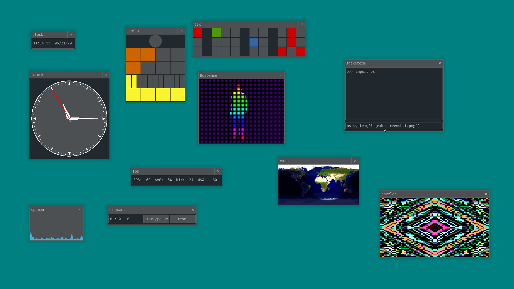

# snakeware
snakeware is a free Linux distro with a Python userspace inspired by the Commodore 64. You are booted directly into a
Python interpreter, which you can use to do whatever you want with your computer.

[Check out our latest demo on YouTube!](https://www.youtube.com/watch?v=spJD7uZAkds)

[Official Snakeware Discord](https://discord.gg/yr27Zsy)

IRC Channel: `#snakeware` on `irc.rizon.net`.



## Motivation
The idea is that a Python OS would be fun to use and very easy to contribute to. Even relative beginners might be able
to find ways to meaningfully contribute apps and other code to this distro.

Our window manager, snakewm, is based on pygame/pygame_gui. We do not use X11; snakewm draws directly to `/dev/fb0`.

We also are not going to be using any other huge and opaque software such as systemd, etc. The goal is to eventually
have a usable set of userspace apps and utilities written entirely in Python, because Python is fun and it Just Werks™.

## Running
[Download the latest release image.](https://github.com/joshiemoore/snakeware/releases)

You can burn the image file to a flash drive and boot it. Instructions to run it on QEMU are below.


### QEMU

To run it snakeware on QEMU:

1. [Download and Install QEMU](https://www.qemu.org/download/). Supports Linux, OSX, and Windows.
2. Open your terminal/command prompt.
3. Navigate to the directory/folder where the snakeware image image was downloaded.
4. Run the command: `qemu-system-x86_64 -drive format=raw,file=snakeware.img -m 2048 -soundhw hda -audiodev id=pa,driver=pa`
5. Wait for it to load.
6. You will be be taken to a Python environment/shell.
7. Launch snakewm with the following Python command:

```
>>> from snakewm.wm import SnakeWM
>>> SnakeWM().run()
```
8. To open the app menu press the left WinKey (Left CMD key ⌘ on macOS).


## Building
The snakeware build system is based on buildroot. See the `snakeware/` directory in this repo for resources and
documentation on how to build your own snakeware distro image.

**NOTE:** If you are only contributing apps or other code to snakewm, you don't need to build a whole snakeware distro 
image to test your changes. Simply make your changes to snakewm then run `sudo python wm.py` in the `snakewm/` 
directory. snakewm will then start drawing itself directly to the framebuffer and you can test out your changes. 
Press `ALT+ESC` to return to your normal desktop. (It would still be good to test your changes in an actual
snakeware environment though.)

## Contributing
Developers of all experience levels are welcome and encouraged to contribute to snakeware. Python enthusiasts that are
familiar with pygame and pygame_gui will be able to write their own snakeware apps very easily. See existing apps
in `snakewm/apps/` for examples of how to get started, and feel free to ask questions if you need help.

Those with experience building Linux systems are encouraged to contribute to the underlying aspects of the distro,
such as the build/package scripts and configuration for the kernel, GRUB, etc. The build system is currently not
very streamlined or robust, and I am sure that there are better ways to do a lot of it.

I would also like to eventually stop using Busybox for intialization and find a way to perform all necessary init from
the Python environment, so ideas about that are welcome.

## TODO
This is an abridged list of future plans:

* Raspberry Pi configs for buildroot and kernel!!!!!!!
* Fix pip module installation - won't work when cross-compiling
* Many more snakewm apps
* ~~App menu for choosing apps to run~~
* ~~Improved/streamlined build system~~
* Improved kernel config
* snake-games - full-screen user games separate from SnakeWM
* ~~Modify partition scheme for faster boot - /usr on its own partition?~~
* Take advantage of pygame_gui's theme functionality
* ~~Dynamic/interactive desktop backgrounds~~
* ~~Sound support~~
* Networking -> web browser
    + snakechat - chat with everyone else who's using snakeware
    + Gopher client?
* Ditch busybox, init via Python somehow
* ...
